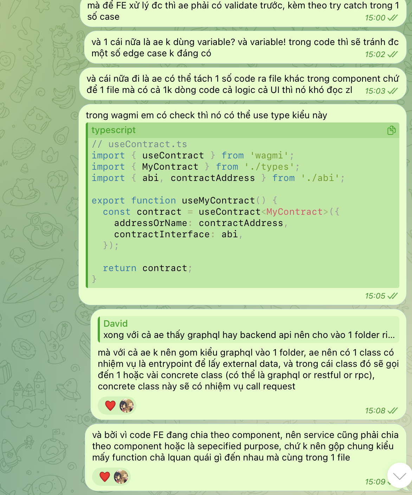

# DeFiKit Rocket Launch

## Quick Start

#### install dependencies using **npm**

```sh
npm install
```

#### edit variables

cp .env.example .env.local

#### run translate

```sh
npm run trans
```

#### run project with development mode

-   api

```sh
  npm run prepare-husky
```

```sh
  npm run dev
```

#### run project with production mode

```sh
npm run build
```

```sh
 npm run start
```
Open [http://localhost:3000](http://localhost:3000) with your browser to see the result.

That's it, you're all set!

## Resources

To learn more about the packages used in this project, take a look at the following resources:

- [Next.js Documentation](https://nextjs.org/docs) - learn about Next.js features and API.
- [Learn Next.js](https://nextjs.org/learn) - an interactive Next.js tutorial.
- [React Typescript Cheatsheet](https://react-typescript-cheatsheet.netlify.app/docs/basic/setup/) - helpful tips for using Typescript with React.
- [wagmi Documentation](https://wagmi-xyz.vercel.app/) - learn about the wagmi React hooks for Ethereum.
- [Tailwind CSS Documentation](https://tailwindcss.com/) - learn about the Tailwind CSS styling framework.

## Deploy on Vercel

[](https://vercel.com/new/clone?repository-url=https%3A%2F%2Fgithub.com%2FSeth-McKilla%2Fnextjs-wagmi&env=NEXT_PUBLIC_INFURA_ID)

The easiest way to deploy your Next.js app is to use the [Vercel Platform](https://vercel.com/new?utm_medium=default-template&filter=next.js&utm_source=create-next-app&utm_campaign=create-next-app-readme) from the creators of Next.js.

[test webhook]



Test